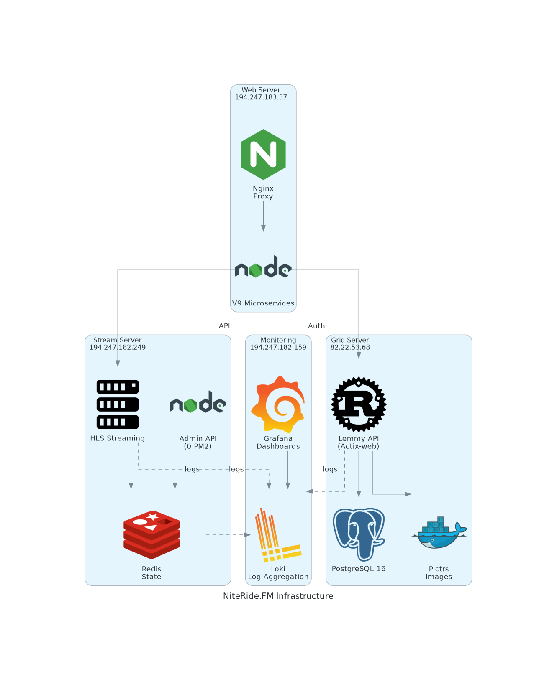

# NiteRide.FM Infrastructure Architecture

*Auto-generated on 2026-02-23 06:35 UTC*

---

## Web Server

**IP:** `194.247.183.37`  
**Purpose:** Orchestration, Auth, V9 Microservices (Identity, Public, Guide), Nginx proxy

*No discovery data available*

## Stream Server

**IP:** `194.247.182.249`  
**Purpose:** HLS streaming, Redis state, Admin backend (Library, Scheduling, Commercials)

*No discovery data available*

## Grid Server

**IP:** `82.22.53.68`  
**Purpose:** Lemmy fork with Supabase auth, PostgreSQL 16, Pictrs image hosting

### System

| Property | Value |
|----------|-------|
| Hostname | `11471.example.is` |
| OS | Ubuntu 24.04.3 LTS |
| Kernel | 6.8.0-90-generic |
| Load Average | 0.01, 0.10, 0.05 |

**Memory:** 1.0 GB / 3.8 GB (26.4% used)

### Disk Usage

| Mount | Size | Used | Available | % |
|-------|------|------|-----------|---|
| `/` | 52.8 GB | 29.0 GB | 21.1 GB | 58% |

### Docker Containers

| Name | Image | Ports | Status |
|------|-------|-------|--------|
| docker-lemmy-1 | `ghcr.io/gunswayfm/niteridefm_grid:latest` | 10002:10002, 10002:10002 | Up 7 days |
| docker-proxy-1 | `nginx:1-alpine` | 1236:1236, 1236:1236, 8536:8536, 8536:8536 | Up 8 days |
| docker-lemmy-ui-1 | `dessalines/lemmy-ui:0.19.14` | 1234/tcp | Up 8 days (healthy) |
| docker-pictrs-1 | `asonix/pictrs:0.5.16` | 6669/tcp, 8080/tcp | Up 8 days |
| docker-postgres-1 | `pgautoupgrade/pgautoupgrade:16-alpine` | 5433:5432, 5433:5432 | Up 8 days (healthy) |

### Listening Ports

| Port | Process | PM2 App | Address |
|------|---------|---------|----------|
| 22 | sshd | - | all interfaces |
| 22 | sshd | - | [::] |
| 53 | systemd-resolve | - | 127.0.0.54 |
| 53 | systemd-resolve | - | 127.0.0.53%lo |
| 80 | nginx | - | all interfaces |
| 443 | nginx | - | all interfaces |
| 1236 | docker-proxy | - | all interfaces |
| 1236 | docker-proxy | - | [::] |
| 5433 | docker-proxy | - | all interfaces |
| 5433 | docker-proxy | - | [::] |
| 8536 | docker-proxy | - | all interfaces |
| 8536 | docker-proxy | - | [::] |
| 10002 | docker-proxy | - | all interfaces |
| 10002 | docker-proxy | - | [::] |

### Key Systemd Services

| Service | Status |
|---------|--------|
| docker.service | active/running |
| nginx.service | active/running |

### Nginx

**Version:** 1.24.0 (Ubuntu)

**Proxy Routes:**
- `http://127.0.0.1:8536`

### Service Connections

| From | To | Port | Type |
|------|-----|------|------|
| nginx | http://127.0.0.1:8536 | 8536 | proxy |

---

## Monitoring Server

**IP:** `194.247.182.159`  
**Purpose:** Grafana dashboards, Loki log aggregation

### System

| Property | Value |
|----------|-------|
| Hostname | `is-vmmini` |
| OS | Ubuntu 24.04.1 LTS |
| Kernel | 6.8.0-39-generic |
| Load Average | 0.10, 0.04, 0.01 |

**Memory:** 3.6 GB / 5.8 GB (62.4% used)

### Disk Usage

| Mount | Size | Used | Available | % |
|-------|------|------|-----------|---|
| `/` | 117.0 GB | 13.8 GB | 98.4 GB | 13% |

### PM2 Services

| Name | Port | Status | Memory | CPU | Restarts |
|------|------|--------|--------|-----|----------|
| stream-probe | 9100 | online | 60 MB | 0% | 39 |

### Listening Ports

| Port | Process | PM2 App | Address |
|------|---------|---------|----------|
| 22 | sshd | - | all interfaces |
| 53 | systemd-resolve | - | 127.0.0.54 |
| 53 | systemd-resolve | - | 127.0.0.53%lo |
| 3000 | grafana | - | all interfaces |
| 3100 | loki | - | all interfaces |
| 9080 | promtail | - | all interfaces |
| 9095 | loki | - | all interfaces |
| 9100 | unknown | - | all interfaces |
| 33361 | chrome | stream-probe | 127.0.0.1 |
| 33603 | promtail | - | all interfaces |

### Key Systemd Services

| Service | Status |
|---------|--------|
| docker.service | active/running |
| grafana-server.service | active/running |
| loki.service | active/running |

### Nginx

**Version:** bin

---

## FE PPE Server

**IP:** `82.22.53.147`  
**Purpose:** Pre-production frontend environment (staging branch)

### System

| Property | Value |
|----------|-------|
| Hostname | `niteride-fe-ppe` |
| OS | Ubuntu 24.04.1 LTS |
| Kernel | 6.8.0-39-generic |
| Load Average | 0.08, 0.02, 0.01 |

**Memory:** 887.3 MB / 5.8 GB (15.0% used)

### Disk Usage

| Mount | Size | Used | Available | % |
|-------|------|------|-----------|---|
| `/` | 117.0 GB | 6.6 GB | 105.5 GB | 6% |

### PM2 Services

| Name | Port | Status | Memory | CPU | Restarts |
|------|------|--------|--------|-----|----------|
| niteride-backend | 3000 | online | 93 MB | 0% | 3 |
| guide-service | 3105 | online | 75 MB | 0% | 3 |
| identity-service | 3001 | online | 97 MB | 0% | 15 |
| chat-service | 4000 | online | 92 MB | 0% | 3 |

### Listening Ports

| Port | Process | PM2 App | Address |
|------|---------|---------|----------|
| 22 | sshd | - | all interfaces |
| 53 | systemd-resolve | - | 127.0.0.53%lo |
| 53 | systemd-resolve | - | 127.0.0.54 |
| 80 | nginx | - | all interfaces |
| 443 | nginx | - | all interfaces |
| 3000 | unknown | - | all interfaces |
| 3001 | unknown | - | all interfaces |
| 3105 | unknown | - | all interfaces |
| 4000 | unknown | - | all interfaces |
| 5432 | postgres | - | all interfaces |
| 5432 | postgres | - | [::] |
| 6379 | redis-server | - | 127.0.0.1 |
| 6379 | redis-server | - | [::1] |

### Key Systemd Services

| Service | Status |
|---------|--------|
| docker.service | active/running |
| nginx.service | active/running |
| postgresql@16-main.service | active/running |
| redis-server.service | active/running |

### Nginx

**Version:** 1.24.0 (Ubuntu)

**Proxy Routes:**
- `http://127.0.0.1:3105/$1`
- `https://api-ppe.niteride.fm/uploads/`
- `http://127.0.0.1:3000`
- `https://api-ppe.niteride.fm/ch1/`
- `http://127.0.0.1:4000`
- `https://api-ppe.niteride.fm/hls/`
- `https://api-ppe.niteride.fm`
- `http://82.22.53.161:3002`
- `http://127.0.0.1:3001`
- `http://127.0.0.1:4000/socket.io/`
- *...and 3 more*

### Service Connections

| From | To | Port | Type |
|------|-----|------|------|
| niteride-backend | postgres | 5432 | data |
| guide-service | postgres | 5432 | data |
| identity-service | postgres | 5432 | data |
| chat-service | postgres | 5432 | data |
| niteride-backend | postgres | 5432 | data |
| guide-service | postgres | 5432 | data |
| identity-service | postgres | 5432 | data |
| chat-service | postgres | 5432 | data |
| nginx | http://127.0.0.1:3105/$1 | 3105 | proxy |
| nginx | https://api-ppe.niteride.fm/uploads/ | 80 | proxy |
| nginx | http://127.0.0.1:3000 | 3000 | proxy |
| nginx | https://api-ppe.niteride.fm/ch1/ | 80 | proxy |
| nginx | http://127.0.0.1:4000 | 4000 | proxy |
| nginx | https://api-ppe.niteride.fm/hls/ | 80 | proxy |
| nginx | https://api-ppe.niteride.fm | 80 | proxy |
| nginx | http://82.22.53.161:3002 | 3002 | proxy |
| nginx | http://127.0.0.1:3001 | 3001 | proxy |
| nginx | http://127.0.0.1:4000/socket.io/ | 4000 | proxy |
| nginx | https://api-ppe.niteride.fm/hls/segments/ | 80 | proxy |
| nginx | https://api-ppe.niteride.fm/ch2-segments/ | 80 | proxy |
| nginx | https://api-ppe.niteride.fm/ch2/ | 80 | proxy |

### External Services

| Service | Type | Detected In |
|---------|------|-------------|
| Supabase | auth/database | .env |
| Stripe | payments | .env |

---

## BE PPE Server

**IP:** `82.22.53.161`  
**Purpose:** Pre-production backend environment (staging branch)

### System

| Property | Value |
|----------|-------|
| Hostname | `niteride-be-ppe` |
| OS | Ubuntu 24.04.1 LTS |
| Kernel | 6.8.0-39-generic |
| Load Average | 0.15, 0.06, 0.01 |

**Memory:** 1.3 GB / 5.8 GB (23.1% used)

### Disk Usage

| Mount | Size | Used | Available | % |
|-------|------|------|-----------|---|
| `/` | 117.0 GB | 45.5 GB | 66.6 GB | 41% |

### PM2 Services

| Name | Port | Status | Memory | CPU | Restarts |
|------|------|--------|--------|-----|----------|
| playlist-generator-ch1 | 9050 | online | 78 MB | 0% | 17 |
| stream-guard | - | online | 78 MB | 0% | 0 |
| stream-monitor | - | online | 76 MB | 0% | 0 |
| cdn-prewarmer | - | online | 111 MB | 0% | 1 |
| content-segmenter | - | online | 81 MB | 0% | 0 |
| streaming-core | - | stopped | 0 MB | 0% | 21 |
| admin-service | 3002 | online | 100 MB | 3% | 21 |
| storage-service | - | online | 88 MB | 0% | 1 |
| rtmp-receiver | - | online | 84 MB | 0% | 0 |
| live-controller | - | online | 71 MB | 0% | 0 |
| playlist-generator-ch2 | 9050 | online | 72 MB | 0% | 1 |
| streaming-core-ch2 | - | online | 97 MB | 0% | 2 |
| streaming-core-ch1 | - | online | 105 MB | 0% | 0 |

### Listening Ports

| Port | Process | PM2 App | Address |
|------|---------|---------|----------|
| 22 | sshd | - | all interfaces |
| 53 | systemd-resolve | - | 127.0.0.53%lo |
| 53 | systemd-resolve | - | 127.0.0.54 |
| 80 | nginx | - | all interfaces |
| 443 | nginx | - | all interfaces |
| 631 | cupsd | - | all interfaces |
| 631 | cupsd | - | [::] |
| 1935 | nginx | - | all interfaces |
| 1936 | unknown | - | all interfaces |
| 3002 | unknown | - | all interfaces |
| 3005 | unknown | - | all interfaces |
| 5432 | postgres | - | all interfaces |
| 5432 | postgres | - | [::] |
| 6379 | redis-server | - | 127.0.0.1 |
| 6379 | redis-server | - | [::1] |
| 8444 | tusd | - | 127.0.0.1 |
| 9003 | unknown | - | all interfaces |
| 9004 | unknown | - | all interfaces |
| 9050 | unknown | - | all interfaces |
| 9065 | unknown | - | all interfaces |
| 9070 | unknown | - | all interfaces |
| 9100 | unknown | - | all interfaces |

### Key Systemd Services

| Service | Status |
|---------|--------|
| docker.service | active/running |
| nginx.service | active/running |
| postgresql@16-main.service | active/running |
| redis-server.service | active/running |

### Nginx

**Version:** 1.24.0 (Ubuntu)

**Proxy Routes:**
- `http://127.0.0.1:3002`

### Service Connections

| From | To | Port | Type |
|------|-----|------|------|
| stream-guard | redis | 6379 | data |
| stream-monitor | redis | 6379 | data |
| streaming-core | redis | 6379 | data |
| streaming-core-ch2 | redis | 6379 | data |
| streaming-core-ch1 | redis | 6379 | data |
| admin-service | postgres | 5432 | data |
| storage-service | postgres | 5432 | data |
| admin-service | postgres | 5432 | data |
| storage-service | postgres | 5432 | data |
| nginx | http://127.0.0.1:3002 | 3002 | proxy |

### External Services

| Service | Type | Detected In |
|---------|------|-------------|
| Supabase | auth/database | .env |

---

## FE CH2 Server

**IP:** `82.22.53.167`  
**Purpose:** Channel 2 frontend environment

### System

| Property | Value |
|----------|-------|
| Hostname | `niteride-fm-ch2` |
| OS | Ubuntu 24.04.1 LTS |
| Kernel | 6.8.0-39-generic |
| Load Average | 0.45, 0.39, 0.38 |

**Memory:** 1.2 GB / 15.6 GB (7.7% used)

### Disk Usage

| Mount | Size | Used | Available | % |
|-------|------|------|-----------|---|
| `/` | 156.4 GB | 44.4 GB | 105.5 GB | 30% |

### PM2 Services

| Name | Port | Status | Memory | CPU | Restarts |
|------|------|--------|--------|-----|----------|
| playlist-generator-ch2 | 9050 | online | 80 MB | 0% | 6 |
| streaming-core-ch2 | - | online | 108 MB | 4.3% | 8 |
| stream-guard-ch2 | - | online | 78 MB | 0% | 2 |
| stream-monitor-ch2 | - | online | 78 MB | 0% | 0 |
| cdn-prewarmer-ch2 | - | online | 76 MB | 0% | 0 |
| content-segmenter-ch2 | - | online | 80 MB | 0% | 0 |
| storage-service-ch2 | - | online | 154 MB | 21.7% | 2 |
| rtmp-receiver-ch2 | - | online | 84 MB | 0% | 0 |
| live-controller-ch2 | - | online | 73 MB | 0% | 0 |

### Listening Ports

| Port | Process | PM2 App | Address |
|------|---------|---------|----------|
| 22 | sshd | - | all interfaces |
| 53 | systemd-resolve | - | 127.0.0.53%lo |
| 53 | systemd-resolve | - | 127.0.0.54 |
| 80 | nginx | - | all interfaces |
| 1936 | unknown | - | all interfaces |
| 6379 | redis-server | - | all interfaces |
| 9003 | unknown | - | all interfaces |
| 9004 | unknown | - | all interfaces |
| 9050 | unknown | - | all interfaces |
| 9060 | unknown | - | all interfaces |
| 9061 | unknown | - | all interfaces |
| 9070 | unknown | - | all interfaces |
| 9100 | unknown | - | all interfaces |

### Key Systemd Services

| Service | Status |
|---------|--------|
| docker.service | active/running |
| nginx.service | active/running |
| redis-server.service | active/running |

### Nginx

**Version:** 1.24.0 (Ubuntu)

**Proxy Routes:**
- `http://localhost:9050/`

### Service Connections

| From | To | Port | Type |
|------|-----|------|------|
| streaming-core-ch2 | redis | 6379 | data |
| stream-guard-ch2 | redis | 6379 | data |
| stream-monitor-ch2 | redis | 6379 | data |
| nginx | http://localhost:9050/ | 9050 | proxy |

### External Services

| Service | Type | Detected In |
|---------|------|-------------|
| Supabase | auth/database | .env |
| Object Storage | storage | .env |

---

## Data Sources

This documentation is automatically generated from live infrastructure discovery.
Discovery runs daily at 6 AM UTC via GitHub Actions.

See `discovery/` for raw JSON data and `history/` for historical snapshots.
